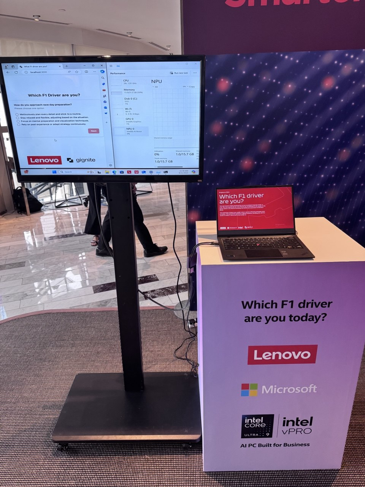

# WhatF1DriverAreYou 🏎️

  <p align="center">
  
&nbsp; &nbsp; &nbsp; &nbsp;
  
&nbsp; &nbsp; &nbsp; &nbsp;
  
</p>

An AI-powered application that tells you which Formula 1 driver matches your personality! This project showcases the power of Intel's Neural Processing Unit (NPU) by running a 2B parameter LLM model optimized for Intel hardware. The application combines a general-purpose LLM service with a specialized web interface that handles the F1 driver matching logic.

## 📸 Singapore F1 Grand Prix 2024 Demo

<div align="center">
  
  <p><em>WhatF1DriverAreYou demo at Lenovo Leaders Circle during the Singapore F1 Grand Prix 2024</em></p>
</div>

This project was showcased at the prestigious Lenovo Leaders Circle event in Singapore, coinciding with the 2024 Formula 1 Singapore Grand Prix. The demonstration highlighted the capabilities of Lenovo's NPU-enabled devices in running sophisticated AI models while maintaining high performance and energy efficiency.

## 🤝 Project Collaboration

This project was developed in collaboration with:

- **Intel**: Providing the LLaVA-Gemma 2B model and comprehensive documentation for the Intel NPU Acceleration Library, enabling optimal performance on NPU-enabled devices
- **Lenovo**: Providing cutting-edge hardware infrastructure and NPU-enabled devices for optimal model performance
- **Gignite.ai**: Contributing expertise in AI model optimization, web application development, and deployment strategies

The collaboration brings together Intel's AI technology, Lenovo's hardware excellence, and Gignite.ai's AI expertise to create a unique F1 personality matching experience.

## 🚀 Project Overview

WhatF1DriverAreYou consists of two main services:
- **AI Service**: A FastAPI backend running Intel's LLaVA-Gemma 2B model optimized for NPU, serving as a general-purpose language model endpoint
- **Web App**: A modern, responsive frontend application developed by Gignite.ai that handles the F1 driver matching logic and user interaction

## 🛠️ Technical Stack

### AI Service
- FastAPI
- PyTorch
- Intel NPU Acceleration Library
- Transformers (Hugging Face)
- Intel LLaVA-Gemma 2B model

### Web Application
- T3 Stack
- React
- TypeScript
- Next.js
- Tailwind CSS
- tRPC

### Intel NPU Integration
This project leverages Intel's NPU Acceleration Library to optimize model performance. Key features include:
- Model compilation for NPU execution
- Optimized tensor operations
- Hardware-specific performance tuning
- Efficient memory management

For detailed implementation guidelines, refer to Intel's [NPU Acceleration Library Documentation](https://www.intel.com/npu-docs).

### Prerequisites

- Intel hardware with NPU support
- Python 3.8+
- PyTorch
- Intel NPU Acceleration Library

## 📦 Installation

1. Clone the repository:
```bash
git clone https://github.com/yourusername/WhatF1DriverAreYou.git
cd WhatF1DriverAreYou
```

2. Install dependencies:
```bash
pip install -r requirements.txt
```

3. Start the AI service:
```bash
cd ai-service
python main.py
```

The API will be available at `http://localhost:8000`

4. Start the web application:
```bash
cd web-app
pnpm install
pnpm dev
```

The web application will be available at `http://localhost:3000`

## 🔌 API Endpoints

### POST /generate
General-purpose LLM endpoint that processes text prompts using the Intel LLaVA-Gemma 2B model.

**Request Body:**
```json
{
    "prompt": "your prompt here"
}
```

**Response:**
```json
{
    "response": "model generated text response"
}
```

The F1 driver matching logic and specialized prompts are handled by the web application, which uses this endpoint as its foundation for AI functionality.

## 🚧 Project Structure

```
WhatF1DriverAreYou/
├── assets/               # Project assets (logos and demo images)
├── ai-service/          # FastAPI service running Intel's NPU-optimized LLM
│   ├── main.py
│   └── requirements.txt
├── web-app/            # T3 Stack (Next.js + tRPC) web application
│   ├── src
│   │   ├── app        # Next.js app router
│   │   ├── components # UI components
│   │   ├── server     # Backend API routes
│   │   └── trpc       # tRPC configuration
│   └── package.json
└── README.md
```

## 🔮 Features

- Real-time inference using Intel's NPU
- Optimized model performance with Intel NPU Acceleration Library
- RESTful API for easy integration

## 📋 Requirements

### AI Service
```txt
fastapi
uvicorn
torch
transformers
pydantic
intel-npu-acceleration-library
```

### Web Application
```txt
// package.json dependencies managed by pnpm
"dependencies": {
  "react": "^18.x",
  "next": "^14.x",
  "@trpc/client": "^10.x",
  "@trpc/server": "^10.x",
  "tailwindcss": "^3.x"
}
```

## 🤝 Contributing

Contributions are welcome! Please feel free to submit a Pull Request.

## 📝 License

This project is licensed under the MIT License - see the LICENSE file for details.

## 🙏 Acknowledgments

- Intel for providing the LLaVA-Gemma 2B model and NPU acceleration technology
- Lenovo for hardware infrastructure support and hosting the showcase at Leaders Circle Singapore
- Gignite.ai for AI expertise, web application development, and system optimization
- The Formula 1 community for inspiration
